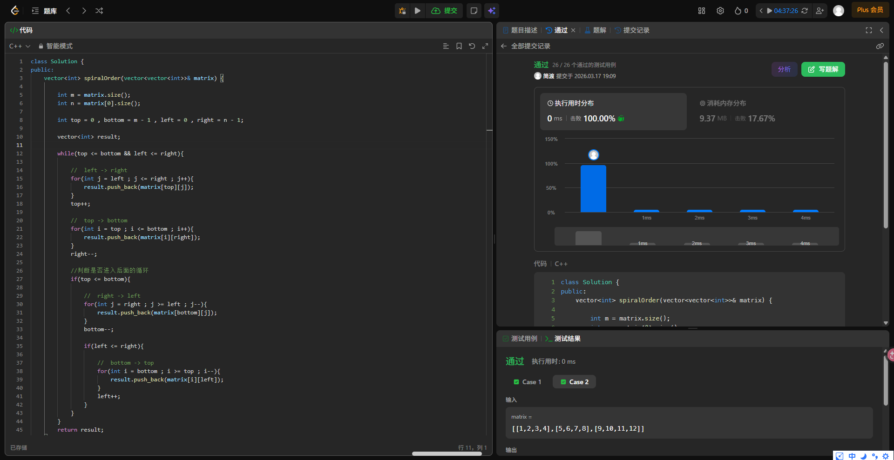

# 力扣-54-螺旋矩阵

## 题意


> ```
> 输入：matrix = [[1,2,3],[4,5,6],[7,8,9]]
> 输出：[1,2,3,6,9,8,7,4,5]
> ```


> ```
> 输入：matrix = [[1,2,3,4],[5,6,7,8],[9,10,11,12]]
> 输出：[1,2,3,4,8,12,11,10,9,5,6,7]
> ```

按顺时针螺旋顺序，输出螺旋矩阵。

---

## 思考过程

### 一、观察规律

1. 第一行按顺序走
2. 然后是下一行最后一个，再下一行……
3. 到最后一行后逆序走完最后一行
4. 从最后一行往上一行走（上一行第一个），再到第二行之后停下来
5. 从这一行开始顺序走到倒数第二个
6. 往下
7. ……循环

### 二、抽象为四步循环

- `a[0][0]` 横向右（j++，0(=t) -> n-1）到 `a[0][n-1]`
- `a[0][n-1]` 竖向下（i++，0(=t) -> m-1）到 `a[m-1][n-1]`
- `a[m-1][n-1]` 横向左（j--，n-1 -> 0(=t)）到 `a[m-1][0]`
- `a[m-1][0]` 竖向上（i--，m-1 -> 1(=t++)）到 `a[1][0]`
- ……

### 三、边界收缩

用四个变量记录当前还没走过的区域的上、下、左、右边界：top、bottom、left、right。

初值：

- top = 0
- bottom = m - 1
- left = 0
- right = n - 1

每一轮的步骤：

- left -> right，走完 top++
- top -> bottom，走完 right--
- right -> left，走完 bottom--
- bottom -> top，走完 left++

### 四、边界条件

三四步什么时候不该走？以 1×4 矩阵为例：

- 第一步：left(0) -> right(3)，走完 top(0)++ 变为 1
- 第二步：top(1) -> bottom(0)，top > bottom，for 循环不执行
- 第三四步：此时 top > bottom，边界交错，不该走

判断方式：第三步前检查 top <= bottom，第四步前检查 left <= right。

4×1 矩阵同理：在竖向移动后判断 left 是否依旧 <= right。

---

## 构思代码

### 数据结构

力扣已给出：`vector<int>`

`vector<int>` 是可自动变长的整数动态数组。常用操作：

- push_back：尾部追加

```cpp
vector<int> result;      // 创建一个空的
result.push_back(5);     // 尾部追加一个 5
result.push_back(3);     // 再追加一个 3
// 现在 result 里是 {5, 3}
```

- size()：返回当前元素个数

```cpp
int m = matrix.size();       // 行数
int n = matrix[0].size();    // 列数（第0行有几个元素）
```

### 输入

`vector<vector<int>>& matrix`

- `vector<vector<int>>`：二维动态数组
- `& matrix`：引用传递，使 `matrix` 作为这个二维数组的代称/别名使用

### 循环结构选择

外层：`while(top <= bottom && left <= right)`

- 为什么用 while？——不知道跑几轮，只知道什么时候该停
- 为什么用 && 不用 ||？——任意一对边界交错就该停，不是两对都交错才停
- 为什么用 <= 不用 <？——top == bottom 说明还剩一行，要走

内层：for 循环

- 每一步都是"从某值走到某值"，起点终点明确，用 for 自然

### while 是"入场合法性检查"

- 进入循环体后，第一步 top++、第二步 right-- 会改变状态
- 所以第三步前要重新检查 top <= bottom
- 第四步前要重新检查 left <= right
- 第一步和第二步不需要额外判断，while 已经保证了

### 第四步的 if 放在第三步的 if 里面

- 原因：如果第三步都不该走（top > bottom），第四步更不该走
- 反过来说，第四步只有在第三步走了之后才需要考虑

---

## 最终题解（手敲）

```cpp
class Solution {
public:
    vector<int> spiralOrder(vector<vector<int>>& matrix) {

        int m = matrix.size();
        int n = matrix[0].size();
        
        int top = 0 , bottom = m - 1 , left = 0 , right = n - 1;

        vector<int> result;

        while(top <= bottom && left <= right){
            
            //  left -> right
            for(int j = left ; j <= right ; j++){
                result.push_back(matrix[top][j]);
            }
            top++;

            //  top -> bottom
            for(int i = top ; i <= bottom ; i++){
                result.push_back(matrix[i][right]);
            }
            right--;

            //判断是否进入后面的循环
            if(top <= bottom){

                //  right -> left
                for(int j = right ; j >= left ; j--){
                    result.push_back(matrix[bottom][j]);
                }
                bottom--;

                if(left <= right){

                    //  bottom -> top
                    for(int i = bottom ; i >= top ; i--){
                        result.push_back(matrix[i][left]);
                    }
                    left++;
                }
            }
        } 
        return result;
    }
};
```



---

## 官方题解(模拟算法)

```cpp
class Solution {
public:
    vector<int> spiralOrder(vector<vector<int>>& matrix) {
        if (matrix.size() == 0 || matrix[0].size() == 0) {
            return {};
        }
        
        int rows = matrix.size(), columns = matrix[0].size();
        vector<int> order;
        int left = 0, right = columns - 1, top = 0, bottom = rows - 1;
        while (left <= right && top <= bottom) {
            for (int column = left; column <= right; column++) {
                order.push_back(matrix[top][column]);
            }
            for (int row = top + 1; row <= bottom; row++) {
                order.push_back(matrix[row][right]);
            }
            if (left < right && top < bottom) {
                for (int column = right - 1; column > left; column--) {
                    order.push_back(matrix[bottom][column]);
                }
                for (int row = bottom; row > top; row--) {
                    order.push_back(matrix[row][left]);
                }
            }
            left++;
            right--;
            top++;
            bottom--;
        }
        return order;
    }
};
```

### 两种题解对比

两种都是模拟算法（边界收缩法）：

- 官方题解：更紧凑，四步走完后一次性收缩四个边界。因为边界没有即时更新，拐角处会被相邻两步覆盖，所以循环范围需要手动避开拐角（top+1、right-1、>left、>top），if 条件用严格小于（left < right && top < bottom）。
- 个人题解：每步走完立即收缩对应边界，不存在拐角重复问题。循环范围写法统一（都是 <= 或 >=），代价是三四步需要分别加 if 判断。

---

## 参考

螺旋矩阵可视化算法（与个人题解逻辑一致）：
https://labuladong.online/algo-visualize/leetcode/spiral-matrix/